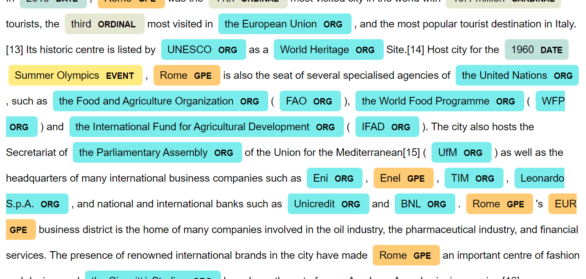
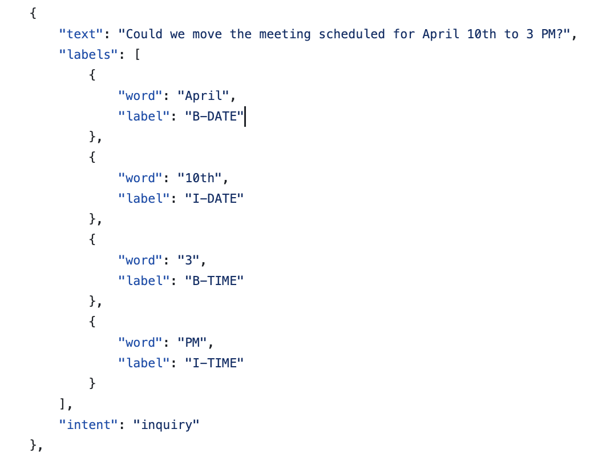
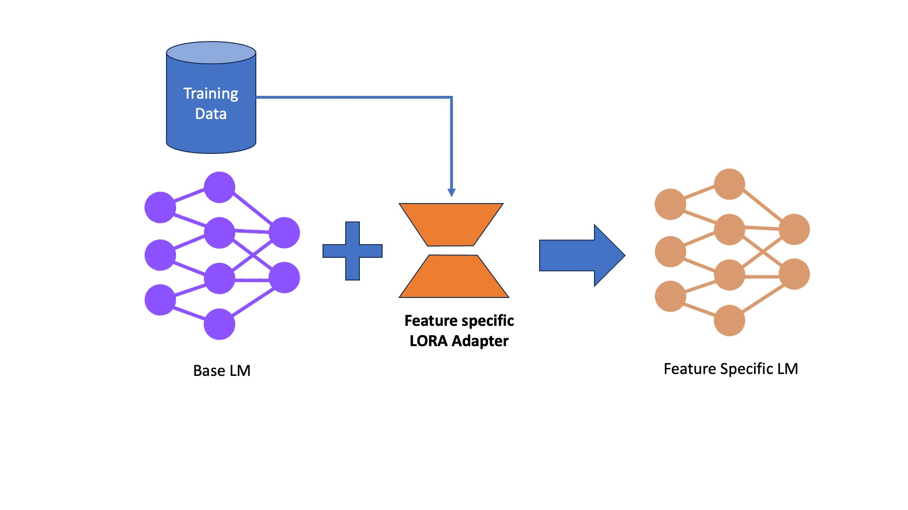

## Named Entity Recognition (NER)

Given some text, we want to identify entities of interest from it.




## Data format and BIO tags

A common format to do NER is to use the BIO tag or "Begin - Inside- Outside" tags.

Let's say you got this piece of text:
`Schedule a meeting with John at john@gmail.com at 7:30 PM on 25 May 2025`

We want **to** assign a tag to each word, or token in this sequence. 

Here is how we want the output to look like.

| word     | tag     |
| -------- | ------- |
| Schedule | O       |
| a        | O       |
| meeting  | O       |
| with     | O       |
| John     | B-NAME  |
| at       | O       |
| john     | B-EMAIL |
| @        | I-EMAIL |
| gmail    | I-EMAIL |
| .com     | I-EMAIL |
| around   | O       |
| 7:30     | B-TIME  |
| AM       | I-TIME  |
| on       | O       |
| 25       | B-DATE  |
| May      | I-DATE  |
| 2025     | I-DATE  |

As you can see, we have marked each word (or subword) with a beginning/inside token. For example "25 May 2025" gets split into `[(25, B-DATE), (May, I-DATE), (2025, I-DATE)]` respectively

# Generating the Data
For training/finetuning a model you would need a dataset. You can find lots of open-source datasets online that are great for NER. When training from scratch, this is one attractive option to consider.

Often you would not find the dataset that you really want, maybe it's because you want to tag a special entity that off-the-shelf datasets don't have, like B-EMAIL is not something many open-source datasets provide.

You got two options here:
- Manually curate a dataset curated to your needs
- Ask an LLM to create a dataset for you.

For convenience we are going to opt for Method #2. We will write some prompts and ask an LLM to generate a JSON file containing training and inference pairs in the BIO format. We will later finetune models on this dataset.

The code for this is provided in the `generate_dataset.py` file. It uses an OpenAI model to generate data via API calling. By default it uses one of their cheaper models (gpt-4.1-mini).

## Dataset format


The above format is how the raw data is generated. It contains a text (our prompt) and the labels we want to generate. Notice how we aren't capturing the "O" tokens like ("Could", "we", "move" etc). Why? This saves tokens generated by the LLM. We can do some post-processing later to default every other absent token as a "O" token.

Two readymade datasets have been provided in the datasets/ directory. One has 200 records, other has 50 records. We are going to use the former as our *train* split and the latter as our *validation* split during training.

Basically, we will train on the 200 records, and evaluate the accuracy of the model on the other file with 50 records. In machine learning, this is a common technique to reduce "overfitting" - a phenomenon where ML models mug up entire training dataset and start underperforming on unseen data outside the training set.

### But wait

Currently the data is saved in a JSON label format. If we truly want to finetune a language model, we need convert it to a format that the language model can output in.

In this project, we will explore 2 ways to do this:
1. Token Generation (SLMs)
2. Token Classification (Masked Language Models)


Let's break it down.

## Token Generation

In this method, we train a autoregressive language model to generate tokens one after the other. To this we first create a sequence of "chat" messages. It looks kinda like this:
```
[
	{
		"role": "system",
		"message": "Please do entity recognition of the following sentence in the BIO format",
	},
	{
		"role": "user",
		"message": "Call me at 6 pm on Friday.",
	},
	{
		"role": "assistant",
		"message": "
		6: B-TIME
		pm: I-TIME
		Friday: B-DATE
		[stop]
		"
	}
]
```

This is how we arrange the input (user message) and output (assistant) message as a list of messages. This is a common format in which modern LLMs are trained (https://platform.openai.com/docs/guides/text?api-mode=responses)

Then we convert the above sequence into a string format, and train on the task of next-word-prediction. Basically, this teaches the LLM how to generate assistant response in the desired format when user messages are input.

From our data format mentioned in the dataset section, some basic string manipulation is all we need to convert our dictionary structure into a string sequence as shown above. This dataset logic is written inside the `causal_slms/data_loader.py` file.

The model is trained inside the `causal_slms/train_slm.py` file.  Inference can be done using the `causal_slms/infer.py` file.

## Token Classification

In this method, we input the tokens into a transformer model and predict the correct class for each token. Where the Generation task outputs free-flowing english text one-word-at-a-time, classification is a much simpler task. Simply put, for each token in the input, the model must output a specific class (O, B-DATE, I-DATE, B-EMAIL, I-EMAIL, etc). The full list of labels can be found in the `data_loader.py` file.

```
LABEL_2_ID = {
	"B-O": 0,
	"B-DATE": 1,
	"I-DATE": 2,
	"B-TIME": 3,
	"I-TIME": 4,
	"B-EMAIL": 5,
	"I-EMAIL": 6,
	"B-NAME": 7,
	"I-NAME": 8,
}
```

For each token, the mode learns to predict one of the above 6 tokens. Thats why it's not a "generation" task, but a "classification" task.

We are using a particular class of language models called "distillberts" to do this. These models are super-fast, and have like 60M parameters. You can have a look at the code in `train_bert.py`. The inference script is also shared in `infer_bert.py`

## Finetuning strategy

We are using Huggingface's PEFT library (Parameter Efficient FineTuning) to finetune models. This uses a concept called "LORA" (Low Rank Adaptation) to augment existing neural networks to perform additional tasks.

The basic concept is simple. Instead of updating the weights of the entire network, we add new trainable weights to the existing models, and just train these new weights to perform our desired task. 

For example, we can add 500K new weights to the 60M BERT model, and finetune it to our prediction task. This "re-wires" the original network to perform our task without needing to train the original 60M task.

The coolest thing is that you can train several LORAs with different expertise (maybe one LORA just does NER, another generates new emails, another identifies emotion etc). Since you using the same base LM with 60M params, you don't need multiple copies of the model, instead just switch between the small LORAs to do different tasks!

## Hyperparameters

Some important hyperparameters to be aware of here are:
- learning_rate: keeping it too low will slow down the speed of training. Too high however will corrupt the model's weights!
- num_train_epochs: Number of times you show the training examples to the model. Showing it too many times will overfit the model on your training data, meaning your model will become TOO GOOD at your training data, but fail to generalize to unseen datasets. Keeping it too low will make your model underfit the training data - meaning it won't be able to capture all the things it needs to learn. Keeping track of validation error is a good idea.
- Dataset size: Generally if you see your model fail at solving certain edge-cases, adding more training data is a good idea. You can generate it using `generate_dataset.py`, you can add examples inside the prompt itself to guide the LLM to generate specific edge-cases more.
